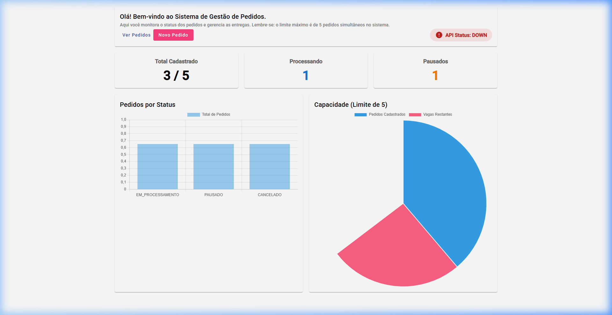
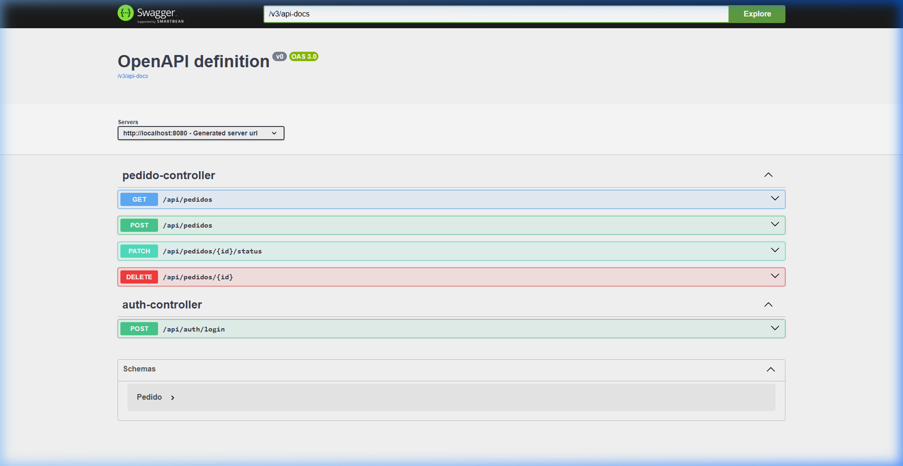

# Desafio Backend Claro

Projeto desenvolvido para o desafio técnico de Desenvolvedor Java Júnior. A solução contempla a implementação de uma API RESTful em Spring Boot, uma interface Single Page Application (SPA) em Angular, e uma infraestrutura completa de observabilidade e orquestração.

## Estrutura do Projeto

- `/backend`: API construída com Java 17, Spring Boot 3 e banco em memória (H2).
- `/frontend`: Aplicação web construída com Angular 17, utilizando Angular Material e Chart.js.
- `/grafana`: Configurações para provisionamento automático de dashboards de monitoramento.

## Execução Rápida (Docker)

A infraestrutura foi orquestrada com Docker Compose para facilitar a execução, isolamento e padronização do ambiente.

1. Na raiz do projeto, execute o comando:
   ```bash
   docker-compose up -d --build
   ```
2. Após a inicialização, as interfaces estarão disponíveis nos seguintes endereços:
   - **Frontend:** http://localhost:4200
   - **Swagger (Documentação da API):** http://localhost:8080/swagger-ui.html
   - **Grafana (Dashboards de Métricas):** http://localhost:3000 (Credenciais: `admin` / `admin`)
   - **Prometheus (Coleta de Métricas):** http://localhost:9090

*Nota: O banco de dados (H2) é inicializado automaticamente com 3 pedidos pré-cadastrados para facilitar a validação e testes exploratórios da interface.*

## Decisões Arquiteturais e Técnicas

### 1. Orquestração e Deploy
O projeto foi containerizado para garantir que seja executado de maneira uniforme em qualquer ambiente. O frontend foi otimizado para produção e é servido através de um servidor Nginx, que já possui as configurações de roteamento (fallback para `index.html`) necessárias para SPAs. O backend utiliza a imagem otimizada JRE 17 do Eclipse Temurin.

## Telas da Aplicação

### Dashboard (Frontend Angular)


### Documentação da API (Swagger UI)


### 2. Observabilidade de Negócio
Além das métricas tradicionais da JVM, a aplicação foi configurada para exportar métricas customizadas de negócio através do Micrometer (como o total absoluto de pedidos e a contagem agrupada por status). A stack do Prometheus e Grafana sobe automaticamente provisionada com a fonte de dados e um Dashboard interativo, demonstrando maturidade em monitoramento sistêmico.

### 3. Design da Interface (Frontend)
Foi adotada a biblioteca Angular Material para assegurar a consistência visual, acessibilidade e componentização clara. Os gráficos do Dashboard utilizam Chart.js e recebem atualizações contínuas via *polling* do RxJS (a cada 5 segundos), provendo uma experiência em tempo real. Adicionalmente, implementou-se o recurso de paginação e ordenação na listagem, e a verificação do status de saúde da API conectada diretamente ao endpoint `/actuator/health` do backend.

### 4. Isolamento de Regras de Negócio (Backend)
Seguindo os princípios de *Separation of Concerns* e SOLID, as validações mais complexas — como o limite estrito de 5 pedidos simultâneos na base e o bloqueio de transições de status inválidas — foram isoladas e encapsuladas na camada de `Service`. Isso garante que a camada de `Controller` permaneça responsável estritamente pelo roteamento e mapeamento de requisições HTTP, facilitando manutenções e testes.

### 5. Tratamento de Exceções e Respostas HTTP
O lançamento de exceções do negócio foi integrado ao `ResponseStatusException`, garantindo que chamadas inválidas (como a criação de um 6º pedido) retornem o código semântico correto (HTTP 400 Bad Request ou HTTP 422 Unprocessable Entity), ao invés do genérico HTTP 500.

## Execução Isolada (Sem Docker)

Caso seja necessário executar e depurar os componentes individualmente:

**Backend:**
```bash
cd backend
./mvnw spring-boot:run
```

**Frontend:**
```bash
cd frontend
npm install
npm start
```
